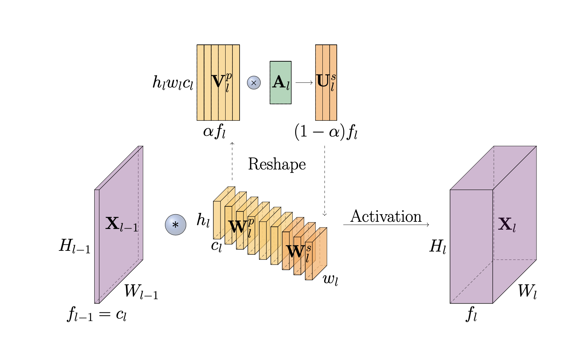
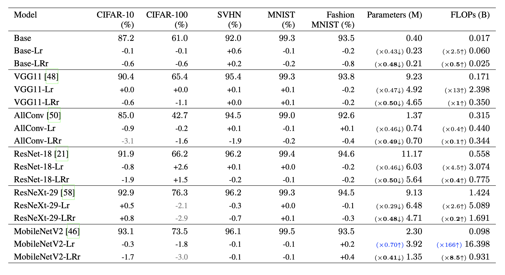

# Exploiting the Redundancy in Convolutional Filters for Parameter Reduction

This repository contains the source for our WACV 2021 paper [Exploiting the Redundancy in Convolutional Filters for Parameter Reduction](https://arxiv.org/pdf/1907.11432).

### Introduction

Convolutional Neural Networks (CNNs) have achieved state-of-the-art performance in many computer vision tasks over the years. However, this comes at the cost of heavy computation and memory intensive network designs, suggesting potential improvements in efficiency. Convolutional layers of CNNs partly account for such an inefficiency, as they are known to learn redundant features. In this work, we exploit this redundancy, observing it as the correlation between convolutional filters of a layer, and propose an alternative approach to reproduce it efficiently. The proposed 'LinearConv' layer learns a set of orthogonal filters, and a set of coefficients that linearly combines them to introduce a controlled redundancy. We introduce a correlation-based regularization loss to achieve such flexibility over redundancy, and control the number of parameters in turn. This is designed as a plug-and-play layer to conveniently replace a conventional convolutional layer, without any additional changes required in the network architecture or the hyperparameter settings. Our experiments verify that LinearConv models achieve a performance on-par with their counterparts, with almost a 50% reduction in parameters on average, and the same computational requirement and speed at inference.

Proposed LinearConv operation


Classification Results


Comparison with SOTA


### Dependencies

- Python 3.6.8
- PyTorch 1.1.0
- torchvision 0.2.2
- thop 0.0.22

### Quick start

- This repository contains multiple versions of LinearConv:
    - `linearconv.py`: vanilla version
    - `linearconv_lowrank.py`: version in which, the matrix of linear coefficients is decomposed into two low-rank matrices with constant rank.
    - `linearconv_rankratio.py`: version in which, the matrix of linear coefficients is decomposed into two low-rank matrices with the rank as a propotion of number of filters.
    - `linearconv_sparse.py`: version in which, the matrix of linear coefficients is pruned to be sparse.

- `corr_reg.py` is the proposed correlation-based regularization loss whcih makes the primary filters of LinearConv, linearly-independent.

- Use the code in `dataloaders.py` to select one of the datasets: [CIFAR-10, CIFAR-100](https://www.cs.toronto.edu/~kriz/cifar.html), [MNIST](http://yann.lecun.com/exdb/mnist/), [FashionMNIST](https://github.com/zalandoresearch/fashion-mnist) and [SVHN](http://ufldl.stanford.edu/housenumbers/).

- `./models/` contains the CNN architectures on which we tested our proposed LinearConv module. Run a model to train and evaluate performance. eg: `python vgg_xcnn.py -t rank -r 1` will run the vanilla LinearConv (full-rank) on VGG11. `-t sparse -s 0.25` corresponds to sparse version with the specified sparsity.

### Reference

If you find our work useful, please consider citing our work:
```
@inproceedings{kahatapitiyaexploiting,
  title={Exploiting the Redundancy in Convolutional Filters for Parameter Reduction},
  author={Kahatapitiya, Kumara and Rodrigo, Ranga},
  booktitle={Proceedings of the IEEE/CVF Winter Conference on Applications of Computer Vision},
  pages={1410--1420}
}
```

### Acknowledgements

We implement our models based on [torchvision/models](https://github.com/pytorch/vision/tree/master/torchvision/models) and parameter/FLOP counter based on [thop](https://github.com/Lyken17/pytorch-OpCounter). We thank the original authors for their work.
